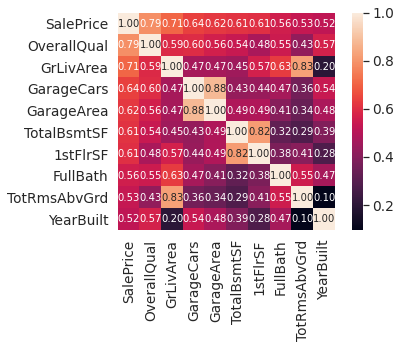

# My_portfolio
Frank's portfolio

[Project 1: Titanic Data](https://www.kaggle.com/qwervs/notebooka2206c42ea)
Predicting the survival rate with Machine Learning

[Project 2: House Prices](https://www.kaggle.com/qwervs/notebooka1e9fd607b)
Cleaning the data and using Statistical models for house prices.

[Project 3: Real or Not(https://www.kaggle.com/qwervs/notebookf2687fc4b6)
Checking if tweets are real or not

